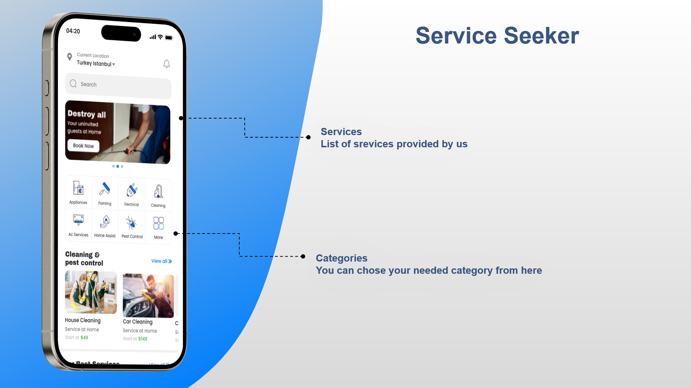
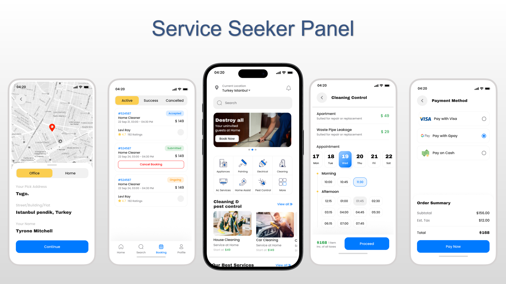
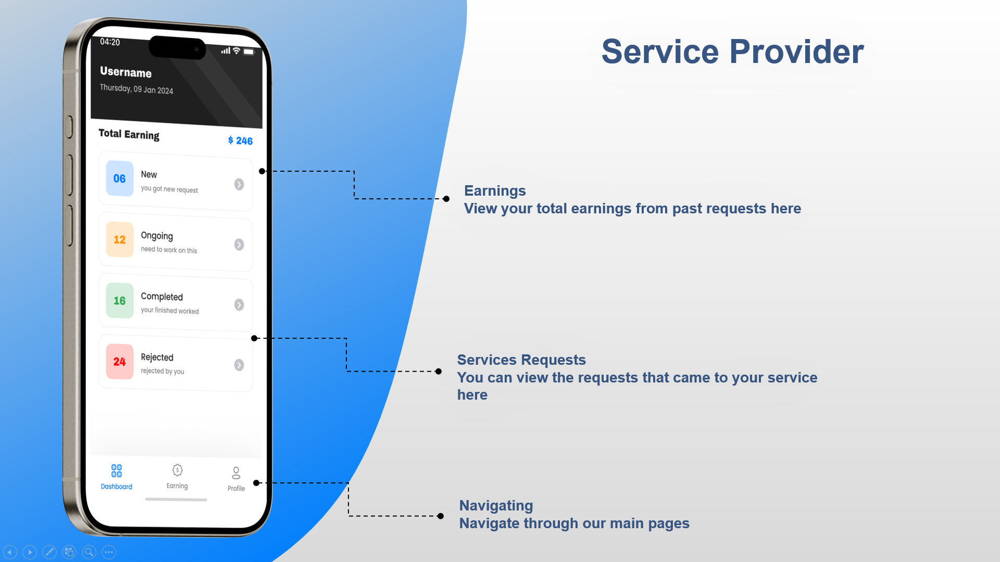
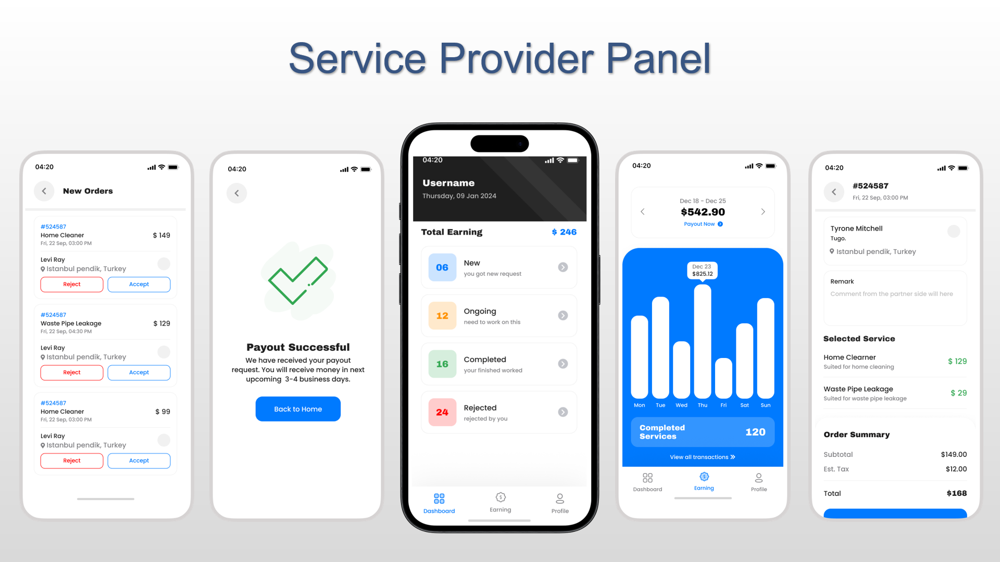
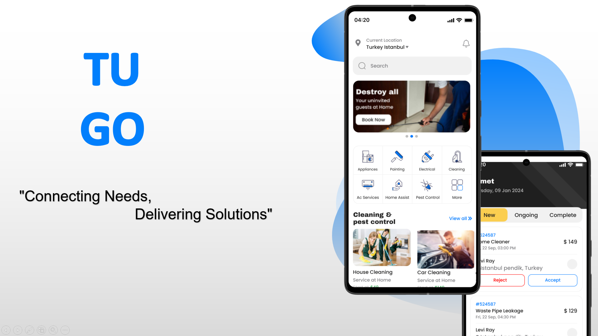
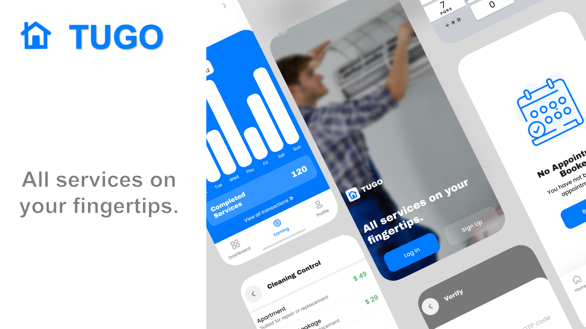

# TUGO

**TUGO** is a comprehensive multi-services application designed to connect customers seeking various services with service providers who offer those services. The application features two distinct panels: one for service seekers and one for service providers.

## Project Overview

- **Service Seeker Panel:** browse, and interact with services.
- **Service Provider Panel:** Provides businesses with a platform to manage their services and interact with Service Seekers.
- **Code Walkthrough:** Provides an overview of the architecture, showcasing the technologies and structure behind the app.

---

## Showcase

### Service Seeker Panel


## **Click the image below to watch the video on how Service Seekers sign up and navigate the app:**


                                                                👇👇👇👇
[](https://youtu.be/tpi8tBRIeMQ)

---

### Service Provider Panel


## **Click the image below to watch the video on how Service providers sign up and navigate the app:**


                                                                👇👇👇👇
[](https://youtu.be/4s2hUrutMJw)

---

### Code Walkthrough


## **Click the image below to watch a code Walkthrough video:**


                                                                👇👇👇👇
[](https://youtu.be/DqihzdMTQgI)

## Getting Started

This project is a starting point for a Flutter application. To get started, follow the instructions below:

## How to Run the Application

To run the application locally on your machine, follow these steps:

1. Clone the repository to your local machine:
    ```bash
    git clone https://github.com/yourusername/applicationstugo.git
    ```

2. Navigate to the project directory:
    ```bash
    cd applicationstugo
    ```

3. Install dependencies:
    ```bash
    flutter pub get
    ```

4. Run the application:
    ```bash
    flutter run
    ```

## Technologies Used

Here is a list of the key technologies, tools, and packages used in the development of **ApplicationStugo**:

### Frontend Development
- **Flutter:** The primary framework for building the mobile application, enabling cross-platform development for iOS and Android.
- **Figma:** Used for UI/UX design, creating prototypes and designing the user interface to ensure a seamless user experience.

### Backend Development
- **Firebase:** A cloud-based platform for handling the backend services, including authentication, database management (Firestore), and cloud storage.
- **Firebase CLI:** Used for deploying and managing Firebase services locally and on the cloud.

### Additional Tools and Technologies
- **Node.js:** Used for running certain backend functions and managing packages.
- **Flutter Packages:** Several useful Flutter packages have been incorporated, such as:
    - **cloud_firestore:** For interacting with Firestore (real-time database).
    - **firebase_auth:** For handling authentication (email/password and social media logins).
    - **firebase_storage:** For storing and retrieving files from Firebase Cloud Storage.
    - **provider:** For state management within the Flutter app.
    - **http:** For making network requests to APIs.
    - **google_maps_flutter:** For integrating Google Maps functionality.

### APIs
- **Google Maps API:** Integrated for location-based features, allowing users and service providers to view and interact with the map.
- **Email.js API:** For sending emails through the app, used for notifications and other communication.

---

Feel free to explore the project and get involved. Contributions are always welcome!

